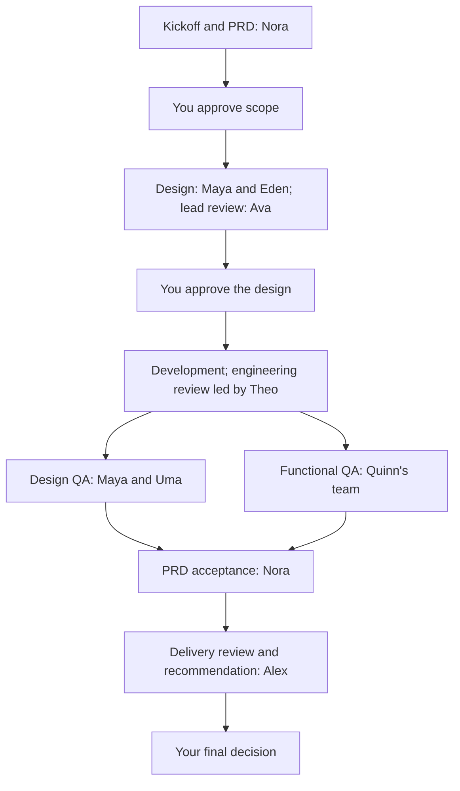

# Virtual Team — proposed project workflow

Accepted direction · 14 September 2026

Implementation status: see [PROJECT_WORKFLOW.md](PROJECT_WORKFLOW.md). This document describes the full target workflow.

This document proposes how a new project moves through the office. The user approved implementing the workflow foundation and using the office improvement project as its first pilot. Approval of this plan does not itself approve a PRD, design, code revision or production release. The implementation document distinguishes connected capabilities from the remaining target workflow.

## 1. Ownership and authority

You own product direction, scope and final approval. Alex, the COO, coordinates delivery, tracks dependencies and brings decisions to you. Nora, the PM, owns the PRD and requirement coverage. Department leads own their internal review decisions. The creator of an artifact cannot act as its independent approver.

A project progresses through approved work products: requirements, design foundations, screen designs, code and a tested delivery. Each handoff points to the exact relevant versions. Chat supports discussion; shared project records hold the authoritative scope, decisions and status.

A new design foundation has an additional owner decision before dependent screens proceed. Both QA tracks must pass. Requested changes return to the responsible owner and affected reviewers; the forward arrows never bypass unresolved findings.

The workflow is applied to a coherent feature or user flow, such as checkout and payment. It does not require every screen in the whole project to finish before an approved feature can move forward.

## 2. Starting a project

You can start directly with Nora: explain the idea, share an existing project document, or provide an existing PRD. Alex should receive visibility automatically once that becomes an approved project; you should not need to repeat the brief to every agent.

Nora creates a draft project brief from the available material. Only missing information that affects the next decision needs to be asked upfront. Unknowns remain visible rather than being silently invented.

The kickoff records:

- The problem, intended users, desired outcome and available evidence.
- Initial scope, exclusions, priorities and any deadline or spending constraints you provide.
- Existing documents, brand guidance and design references, with their source and version.
- Target devices, languages, accessibility needs and other relevant constraints.
- The intended repository, Figma file or team, design system, preview environment and any necessary integrations. These can be pending during discovery; a blocked connection must be resolved before dependent work starts.
- The initial delivery slice, accountable owners, review requirements and your approval points.

Uploaded documents are reference material. Instructions inside them do not override your request or automatically authorize access, deployment or changes to unrelated projects.

A kickoff meeting is optional. The written kickoff record and your answers are enough to proceed. Meeting notes become linked decisions; a conversation or meeting animation is not proof that a decision was approved.

## 3. PRD and scope approval

Nora drafts the PRD. Ira helps make business rules and edge cases explicit. The PRD includes the problem, goals, user journeys, functional requirements, measurable acceptance criteria, important non-functional requirements, exclusions, assumptions and open questions.

Maya reviews whether the journeys are clear enough to design. Theo checks technical feasibility and major dependencies. Quinn checks whether acceptance criteria can be tested. They return comments to Nora rather than silently rewriting the agreed scope.

Nora resolves the comments and presents a PRD revision to you. Alex checks that the proposal has an owner, sensible delivery slices and visible unresolved decisions.

**Owner gate A: Approve the PRD and scope.** This authorizes design and scoped technical planning against that revision. It does not authorize production changes. If a PRD already exists, Nora audits it and proposes amendments instead of recreating it unnecessarily.

## 4. Design foundations

Maya and Eden inspect the supplied Figma file, existing components and any code-side design system. They choose a foundation strategy for your project:

| Starting point | Proposed action | Review |
| --- | --- | --- |
| A usable design system exists | Reuse its variables, components, patterns and approved assets; document any gaps. | Ava confirms suitability. |
| A system exists but lacks required patterns | Eden proposes the smallest needed extensions. | Ava reviews the extensions; you approve material visual or behavioral changes. |
| A suitable external or open design system exists | Compare fit with the brand, stack, coverage and license; propose adoption and adaptation. | Ava and Theo review suitability; you approve the choice. |
| No suitable system exists | Eden creates a minimal foundation for the first delivery slice: tokens, typography, colors, spacing, key components and their states. | Ava reviews; you approve the visual direction before dependent screens proceed. |

**Owner gate B: Approve a new or materially changed design foundation, when needed.** Reusing an unchanged approved system does not add a redundant approval step.

The foundations must cover both Figma definitions and intended code components. A style guide in Figma alone is not a functioning component library. Engineering implements any required code library as an explicit, reviewed task.

## 5. Designing and approving a feature

Maya owns product flows and Figma screens. Eden supports system components. Milo contributes motion only when the feature needs it; Anika contributes research when evidence is missing and research is within the project's scope.

Arjun joins early to discuss feasibility, reusable components, interaction behavior and API needs. Theo or Leo joins where a backend contract affects the experience. Quinn can prepare the test plan in parallel. This collaboration avoids late surprises while preserving the approval gate: production implementation of a screen waits for your approval of its design. Temporary exploratory prototypes are separate work, clearly identified and explicitly scoped.

The design handoff includes:

- Figma links to specific frames and components, with a recorded revision and review snapshot.
- The approved PRD requirements covered by the feature.
- Relevant design tokens and component versions.
- Main, loading, empty, validation, error, success, disabled and permission states as applicable.
- Interaction behavior, content, target viewport behavior and accessibility expectations.
- Accepted constraints and any unresolved questions that block implementation.

**Internal design review:** Ava checks the design against the PRD, approved system, usability, consistency and handoff completeness. Issues return to Maya or Eden. Ava approves the corrected revision before it reaches you.

**Owner gate C: Approve the design for this feature or user flow.** You see the prototype or frames, what changed, Ava's decision and any remaining decisions. Implementation unlocks only for the approved scope and version. Other unapproved features remain in design.

Design continues to support development after handoff. Small explanations are recorded in the task. Material deviations from the approved layout, behavior, component contract or scope require a revised design review and your approval.

### Figma connection assumptions

The designer needs an authorized Figma editing connection. The frontend engineer needs design context and asset access, normally with read access to the approved file. A link alone does not connect either agent or grant permission.

Figma's MCP server supports reading design context and writing native Figma content through supported clients. Design context can include variables, components and layout information used by the coding agent. The frontend engineer still has to implement and validate code in the project's stack; the handoff is not a guarantee of complete application code. Source: [Figma MCP documentation](https://developers.figma.com/docs/figma-mcp-server/).

The exact supported client, authentication, Figma editing tools and rate/access constraints must be verified when we implement the connection. The current Sam worker disables external MCP integrations, so this requires a deliberate capability change rather than assuming the existing office can already use Figma.

## 6. Implementation and engineering review

Theo converts the approved feature into implementation tasks with owners and dependencies. Arjun implements the frontend; Leo handles backend work when needed. Sam can own an entire small feature or a clearly defined cross-stack task. Arjun and Sam should not independently modify the same screen without explicit ownership.

Backend contracts can be designed during the design phase. Backend implementation can run alongside frontend work when its own requirements and dependencies are approved. A feature is not accepted as working against a real backend if it has only been checked against an illustrative fixture.

Maya stays attached to the development task to answer design questions and inspect early previews. Implementation questions that change scope go to Nora; technical decisions go to Theo; disagreements that change the approved product experience come back to you.

Each code handoff supplies a branch and exact commit, the diff, the approved requirement/design references, available preview and actual check results. A build failure or missing capability is reported as blocked or failed, never as a completed test.

Jules performs the detailed code review. Theo owns the engineering approval, checking architectural fit, guidelines, maintainability, integration and evidence of appropriate tests. Their work should be complementary; Theo need not repeat every line comment Jules already resolved.

The implementer fixes blocking findings, and the relevant reviewer checks the corrected revision. Where Theo authored the code, another qualified reviewer is required for independent approval.

## 7. Design QA and functional QA

After engineering approval, two checks run against the same reviewable build and commit:

| Track | Ownership | Evidence |
| --- | --- | --- |
| Design QA | Maya compares the implementation with the approved design; Uma contributes visual and accessibility checks. Ava resolves design disputes. | Annotated comparisons, state coverage, viewport checks and interaction findings. |
| Functional QA | Quinn coordinates; Noor exercises user journeys and edge cases; Tess runs appropriate automation. | Acceptance-criterion results, reproduction steps, actual execution results and regression coverage. |

These tracks run in parallel where capacity permits. Both must pass before product acceptance. If capacity permits only one active run, they queue separately; the UI must not claim they ran simultaneously.

Sage joins for relevant security-sensitive changes, and Rey for performance or reliability risks. The required specialist checks are recorded in the project plan or added when a new risk is identified. Missing tools or test access block the affected check; a missing reviewer is never an automatic pass.

QA findings go to the owner of the defect. A code defect returns to engineering; an ambiguous requirement returns to Nora; a design defect returns to Maya. The updated build is reviewed and retested where affected. Design QA cannot independently authorize a departure from the design you approved.

## 8. Product acceptance, COO review and your final decision

Nora compares the verified feature against the approved PRD. Each acceptance criterion links to its design, implementation and relevant QA evidence. She checks that the delivered outcome matches what was requested, identifies omissions and confirms that no undeclared scope change slipped through.

Alex then checks delivery readiness: required decisions are present, blocking issues are resolved, review versions agree, release dependencies have owners, and the package tells you what is ready and what remains. He compiles the final recommendation. Alex cannot overrule a failed engineering, design or QA gate or impersonate your approval.

**Owner gate D: Review the completed feature or milestone.** You receive a concise review package containing:

- What was requested and what was delivered.
- The preview link, approved Figma reference and exact code revision.
- Ava/Theo/QA/Nora decisions relevant to this delivery, with evidence links.
- Changes since your previous review, known limitations and unresolved non-blocking issues.
- Alex's recommendation and the exact decision requested from you.

You can approve the stated scope, request changes with comments, or hold the decision. Approval is always attached to the actual version you saw. A casual acknowledgment in chat, an unanswered notification or an elapsed timeout is not approval.

Accepting a design, accepting a delivered feature, publishing a pull request and releasing to production are distinct decisions. Preserve the current code workflow initially: approval of an exact code revision can create its PR, then you merge manually in GitHub. Where a merge triggers Vercel deployment, the UI must make that consequence explicit. Robin checks release prerequisites and the deployed outcome within the authority you grant.

## 9. Review and rework rules

1. Every review identifies the artifact version, assigned reviewer, criteria and evidence. Reviewer outcomes are approved, changes requested or blocked.
2. Findings identify their severity, affected requirement/frame/file, observed issue, expected behavior and responsible owner. Suggestions do not silently become new mandatory scope.
3. Changes requested creates a revision task for the responsible agent with the exact feedback. The revised item returns to the reviewer who requested the changes.
4. A changed artifact creates a new version. Earlier decisions remain in history. Approvals covering changed content become stale; downstream work pauses or is explicitly marked as needing reconciliation.
5. Re-review follows actual impact. A changed shared component may affect several screens; an isolated copy correction should not restart unrelated backend work. Leads document the impact decision.
6. User feedback is first classified as a defect, clarification or scope change. Defects return to their owner. Scope changes revise the PRD and affected design plan and return to you for approval.
7. Reviewers use their own review runs and inspect artifacts and evidence. Repeating the creator's completion statement is not an independent review.
8. Alex surfaces unresolved disagreement and repeated revision loops. A proposed initial rule is to escalate after two unsuccessful review rounds; this is configurable and never waives a required approval.
9. While waiting for your answer, dependent work waits. Independent approved work may continue. Agents do not repeatedly interrupt you with the same unanswered question.
10. Offline, failed or interrupted runs preserve their work and show their actual state. Recovery must not duplicate tasks, replay external writes or silently publish an old approval.

## 10. How agents are linked

The shared project record connects the departments. It contains the latest approved PRD, design system decision, design references, tasks, dependencies, artifacts, reviews, decisions and release state.

Every task has one accountable owner, explicit collaborators, required inputs and versions, a defined output, acceptance criteria, reviewers, dependencies and execution status. Each handoff says who produced what, who should act next, what version to use and whether a question blocks progress.

Agents can discuss issues directly in a project or feature conversation. Important decisions are written back to the project record. They receive the relevant brief, decisions and artifacts for their task; they do not need every department's full chat history on every run. New projects have separate context and explicitly configured resource access.

A durable workflow service evaluates prerequisites and queues eligible assignments or reviews. Alex uses it to coordinate the work but cannot bypass its approval rules. Assignments and results have stable identifiers so retries do not create duplicate work. Longer agent runs execute through workers; the website handles access, views, saved work and orchestration requests.

The office view reflects these records: the coding room shows actual active coding assignments; the review room shows pending/active reviews; an idle profile is shown as available; a disconnected worker is shown as offline. Walking to a room is a visual representation of work, not the event that starts or approves it.

All 20 profiles can exist without all 20 agents consuming resources continuously. Run relevant agents when a task, review or user message requires them. Preserve one active coding run per repository initially; expand safe parallelism only when isolation and dependencies are enforced.

## 11. Your review experience

The proposed project workspace contains a project overview, department/agent chats, feature tasks, linked documents and designs, and an **Awaiting your review** inbox.

Each review item answers: which project and feature, what decision is required, what changed, who reviewed it, which version is being approved, where to inspect the actual artifact, and what work that approval unlocks. You should be able to inspect a Figma frame, open a running preview or review a code diff from the same item.

Approvals can cover an explicit batch of screens or features. A batch lists every included item; approval of a payment screen never silently approves the rest of checkout. Alex can bundle related questions and recommendations to reduce interruptions while leaving every decision traceable.

Notifications focus on decisions needed, important blockers and completed milestones. You can still open an individual agent chat at any time. Questions and answers remain attached to the relevant project, feature and artifact revision.

## 12. Example: the payment flow

This is an illustrative planning example, not an approved feature request or a promise that payments are connected.

1. You brief Nora or share a project document. She clarifies the goal and records the payment requirements and acceptance criteria. You approve the PRD scope.
2. Maya and Eden establish the approved design foundation. Maya designs the payment flow and its relevant pending, successful and failed states. Arjun and Leo clarify implementation constraints early.
3. Ava reviews the design. Maya resolves findings. You review and approve the recorded Figma revision for the payment flow.
4. Theo assigns implementation. Arjun builds the frontend; Leo builds necessary backend behavior against the approved contract. Maya helps them stay aligned with the approved experience.
5. Jules reviews the code and Theo grants engineering approval for the exact candidate revision.
6. Maya/Uma perform design QA while Noor/Tess perform the required functional checks. Quinn confirms coverage. Any failed check returns to the responsible owner.
7. Nora verifies the evidence against the payment requirements. Alex compiles the completed delivery and review decisions.
8. You inspect the preview and final changes, then approve, request changes or hold. Publishing and release follow the separately stated actions and existing manual merge rule.

## 13. Proposed implementation order

| Step | Build | Completion evidence |
| --- | --- | --- |
| 1. Project kickoff and shared records | Project creation, source documents, PRD versions, feature tasks and explicit project resource scope. | A user can start from an idea or existing document and inspect a versioned PRD; records are isolated between projects. |
| 2. Review and approval foundation | Reviewer assignments, owner inbox, change requests, version binding, history and dependency blocking. | Unapproved work cannot advance; a changed approved artifact invalidates affected gates; author self-approval and duplicate events are rejected. |
| 3. Design workflow | Nora/Maya/Eden/Ava role connections, permitted Figma reads/writes, design system decision and reviewed design handoff. | One feature reaches your design approval with inspectable Figma artifacts and recorded lead review. |
| 4. Implementation and QA handoffs | Relevant engineering and QA roles, isolated code work, versioned preview, reviews and real test evidence. | The same feature reaches product acceptance; a deliberately failed check returns to its owner and blocks delivery. |
| 5. COO delivery and release coordination | Alex's delivery package, final owner decision, exact-code PR approval and release evidence. | Your decision covers the inspected revision; no unapproved merge or production action occurs. |
| 6. Expand after the pilot | Additional specialists, richer dashboards, meeting support and additional avatar seating. | Expand only after one feature completes the real kickoff-to-review cycle. |

Start with one bounded feature in a specifically connected project. Use the payment flow only as the walkthrough unless you choose it as the pilot. Build the shared project and approval records first, then activate the agents against those records.

## Proposed defaults for discussion

- You approve PRD scope, a new/materially changed design foundation, each coherent design batch and the completed delivery. Leads handle internal revision loops.
- Design and engineering collaborate before handoff; implementation of approved screens begins only after your design decision.
- Design QA and functional QA run as separate tracks and both gate PM acceptance.
- Alex coordinates and checks readiness; department reviewers retain responsibility for their decisions.
- Each approval covers an explicit artifact version and scope; changes never inherit approval silently.
- Chat is the conversation surface, the project record is authoritative, and the 3D office reflects actual work state.
